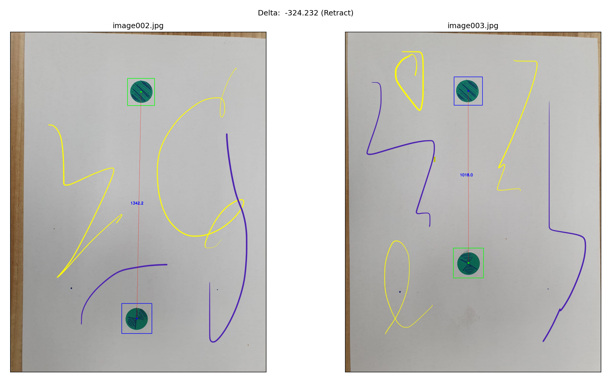
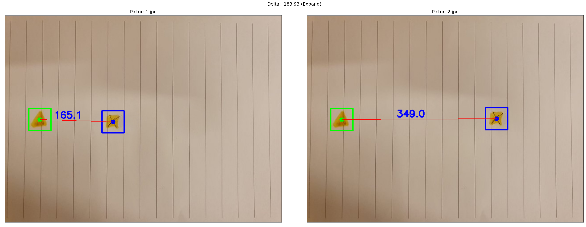

# Templates_Match

TMatch will look and match 2 templates, provided in library and measure the distance between them.
This program was aimed and optimzed for low specs CPU. Using Basic computer vision  
(future plan will use robust NN based algorithm (using GPU)).

## Installation

### Requirements

* Python 3.5+ (it may work with other versions too).
* Linux, Windows or macOS

### Install

```
pip install requirements.txt
```
## From Source
```
git clone https://github.com/taltole/Templates_Match.git
```

## Run
```
python Main.py [-folder]
```
### Attention
- Make sure your template files (2 files) are in the same folder as the images under query.
- Program will find them automatic if named starts with temp...


#### Examples Vis match and measure

<p align='center'>
</img>
</img>
</p>
